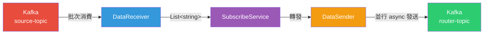

# Demo-DotnetKafka

> 一個 .NET 10 Worker Service，批次消費 Kafka 訊息並高效能地轉發至另一個 Topic，作為訊息中繼 / 路由器。

## 概述

Demo-DotnetKafka 是基於 .NET 10 搭配 `Confluent.Kafka` 的背景 Worker 服務。它訂閱 Kafka 輸入 Topic（`source-topic`），將訊息累積為批次（最多 100 筆或等待 500ms），再並行發送至輸出 Topic（`router-topic`）。架構採用清晰的 DI 模式，將基礎設施、服務與業務邏輯層分離。

## 架構



## 專案結構

```
Demo-DotnetKafka/
├── DemoDotnet.sln
└── demo/
    ├── Program.cs                  # 程式進入點 — 註冊 DI 並啟動 Worker
    ├── Worker.cs                   # BackgroundService 生命週期，委派給 SubscribeService
    ├── demo.csproj                 # .NET 10, Confluent.Kafka 2.12.0
    ├── Dockerfile                  # 多階段建置（SDK → ASP.NET runtime）
    ├── appsettings.json            # Kafka 連線與 Topic 組態
    ├── Common/
    │   └── Kafka/
    │       ├── KafkaFactory.cs     # 建立 Producer（透過 Lazy<T> 單例）與 Consumer 實例
    │       └── KafkaProducer.cs    # 輕量封裝 — 非同步發送至任意 Topic
    ├── Service/
    │   ├── Kafka/
    │   │   ├── DataReceiver.cs     # 批次消費者：填充 buffer 至 100 筆 / 500ms
    │   │   └── DataSender.cs       # 並行非同步發送，使用 Task.WhenAll
    │   └── Business/
    │       └── SubscribeService.cs # 編排者：接收 → 處理 → 發送
    └── DiCollection/
        ├── KafkaCollection.cs      # 擴充方法：註冊 Kafka 基礎設施 + 服務
        └── BusinessCollection.cs   # 擴充方法：註冊業務邏輯服務
```

## 快速開始

### 前置需求
- .NET 10 SDK
- Apache Kafka（執行於 `localhost:9092`）

### 本機執行
```bash
# 取得原始碼
git clone https://github.com/JeffLin0225/Demo-DotnetKafka.git
cd Demo-DotnetKafka/demo

# 啟動服務
dotnet run
```

### Docker 執行
```bash
cd Demo-DotnetKafka/demo
docker build -t demo-dotnet .
docker run --network host demo-dotnet
```

### 組態設定

編輯 `appsettings.json` 或使用環境變數：

| 設定項 | 說明 | 預設值 |
|--------|------|--------|
| `Kafka:BootstrapServers` | Kafka broker 位址 | `localhost:9092` |
| `Kafka:ConsumerGroupId` | Consumer group ID | `worker-group-id` |
| `Kafka:InputTopic` | 消費來源 Topic | `source-topic` |
| `Kafka:OutputTopic` | 發送目標 Topic | `router-topic` |

## 核心元件

| 元件 | 職責 |
|------|------|
| **Worker** | `BackgroundService` — 管理服務生命週期，委派給 `SubscribeService` |
| **SubscribeService** | 編排「接收 → 處理 → 發送」管線 |
| **DataReceiver** | 批次消費者 — 填充 buffer 至 100 筆訊息，逾時 500ms，處理成功後手動 commit |
| **DataSender** | 並行發送者 — 透過 `Task.WhenAll` 同時發送所有訊息以提升吞吐量 |
| **KafkaFactory** | 基礎設施 — 建立執行緒安全的單例 `IProducer`（透過 `Lazy<T>`）與每次呼叫建立的 `IConsumer` |
| **KafkaProducer** | 輕量非同步封裝 `IProducer.ProduceAsync` |

## 運作流程

1. **Worker** 啟動並呼叫 `SubscribeService.StartListener()`
2. **DataReceiver** 訂閱 `source-topic` 並進入消費迴圈
3. 每次迭代中，`FillBuffer()` 收集最多 **100 筆訊息**或等待 **500ms**（以先到者為準）
4. 批次以 `List<string>` 傳遞給 **SubscribeService.ProcessData()**
5. **DataSender.HighPerfSendData()** 透過 `Task.WhenAll` 並行發送所有訊息至 `router-topic`
6. 成功後，Consumer **手動 commit** 最後一筆 offset
7. 失敗時，放棄該批次、延遲 1 秒防止快速失敗迴圈，接著消費下一批

## 設計決策

- **手動 offset commit** — 確保 at-least-once 語義；僅在處理成功後才 commit
- **批次 + 逾時機制** — 平衡吞吐量（100 筆批次）與延遲（最多等 500ms）
- **Lazy 單例 Producer** — 執行緒安全，只建立一次，跨所有發送共用
- **DI 擴充方法** — 透過 `AddKafkaCollection()` 與 `AddBusinessCollection()` 實現模組化註冊，職責清晰分離
