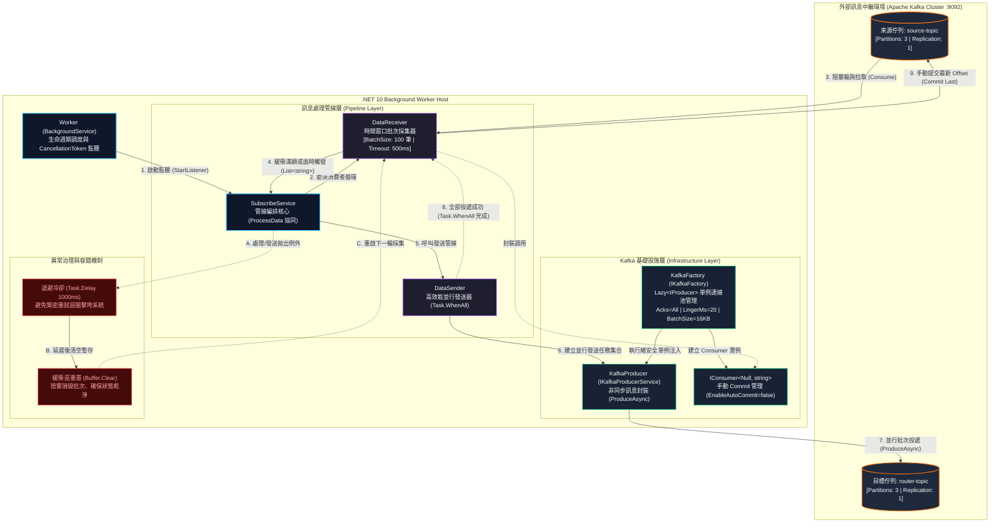

# Demo-DotnetKafka

> 基於 .NET 10 與 Confluent.Kafka 建構的高效能分散式訊息中繼轉發服務（Worker Service），結合雙條件時間窗口批次拉取、Task.WhenAll 高並行轉發與手動 Offset Commit，提供具備 At-Least-Once 保證的高吞吐量串流路由解決方案。

---

## 系統架構

系統由 .NET 10 背景託管服務（BackgroundService）驅動，核心採用分層解耦設計（DI 模組化註冊、基礎設施層、管線編排層與業務服務層），具備清楚的主訊息轉發鏈路與異常退避治理機制：


```mermaid
flowchart TD
    %% 樣式定義
    classDef kafka fill:#1e293b,stroke:#f97316,stroke-width:2px,color:#f8fafc;
    classDef service fill:#0f172a,stroke:#38bdf8,stroke-width:2px,color:#f8fafc;
    classDef component fill:#1e1e2e,stroke:#a855f7,stroke-width:1.5px,color:#f8fafc;
    classDef infra fill:#182234,stroke:#10b981,stroke-width:1.5px,color:#f8fafc;
    classDef error fill:#450a0a,stroke:#ef4444,stroke-width:1.5px,color:#fca5a5;

    subgraph Kafka_Cluster["外部訊息中繼環境 (Apache Kafka Cluster :9092)"]
        K_IN[("來源佇列: source-topic<br/>[Partitions: 3 | Replication: 1]")]:::kafka
        K_OUT[("目標佇列: router-topic<br/>[Partitions: 3 | Replication: 1]")]:::kafka
    end

    subgraph Host_Layer[".NET 10 Background Worker Host"]
        W["Worker (BackgroundService)<br/>生命週期調度與 CancellationToken 監聽"]:::service
        
        subgraph Pipeline_Layer["訊息處理管線層 (Pipeline Layer)"]
            SS["SubscribeService<br/>管線編排核心 (ProcessData 協同)"]:::service
            DR["DataReceiver<br/>時間窗口批次採集器<br/>[BatchSize: 100 筆 | Timeout: 500ms]"]:::component
            DS["DataSender<br/>高效能並行發送器 (Task.WhenAll)"]:::component
        end

        subgraph Infra_Layer["Kafka 基礎設施層 (Infrastructure Layer)"]
            KF["KafkaFactory (IKafkaFactory)<br/>Lazy&lt;IProducer&gt; 單例連線池管理<br/>Acks=All | LingerMs=20 | BatchSize=16KB"]:::infra
            KP["KafkaProducer (IKafkaProducerService)<br/>非同步訊息封裝 (ProduceAsync)"]:::infra
            KC["IConsumer&lt;Null, string&gt;<br/>手動 Commit 管理 (EnableAutoCommit=false)"]:::infra
        end

        subgraph Governance_Layer["異常治理與容錯機制"]
            RETRY["退避冷卻 (Task.Delay 1000ms)<br/>避免緊密重試迴圈擊垮系統"]:::error
            CLEAR["緩衝區重置 (Buffer.Clear)<br/>捨棄損毀批次、確保狀態乾淨"]:::error
        end
    end

    %% 主資料流（步驟 1 ~ 9）
    W -->|"1. 啟動監聽 (StartListener)"| SS
    SS -->|"2. 委派消費者循環"| DR
    KF -->|"建立 Consumer 實例"| KC
    DR -.->|"封裝調用"| KC
    K_IN -->|"3. 阻塞輪詢拉取 (Consume)"| DR

    DR -->|"4. 緩衝滿額或逾時觸發 (List&lt;string&gt;)"| SS
    SS -->|"5. 呼叫發送管線"| DS
    DS -->|"6. 建立並行發送任務集合"| KP
    KF -->|"執行緒安全單例注入"| KP
    KP -->|"7. 並行批次投遞 (ProduceAsync)"| K_OUT
    
    DS -.->|"8. 全部投遞成功 (Task.WhenAll 完成)"| DR
    DR -->|"9. 手動提交最新 Offset (Commit Last)"| K_IN

    %% 治理與異常鏈路（步驟 A ~ C）
    SS -.->|"A. 處理/發送拋出例外"| RETRY
    RETRY -->|"B. 延遲後清空暫存"| CLEAR
    CLEAR -.->|"C. 重啟下一輪採集"| DR
```

---

## 核心元件與職責

| 元件名稱 | 命名空間 / 實作介面 | 設計生命週期 | 職責與關鍵技術細節 |
| :--- | :--- | :--- | :--- |
| **`Worker`** | `DemoDotnetKafka.Worker`<br/>(`BackgroundService`) | HostedService | 託管服務宿主，管理程式生命週期與 `CancellationToken` 取消權杖傳遞，支援 Graceful Shutdown。 |
| **`SubscribeService`** | `DemoDotnetKafka.Service.Business`<br/>`SubscribeService` | Singleton | 業務與管線編排者，協調 `DataReceiver` 與 `DataSender` 的處理邏輯，解耦通訊協定與業務實作。 |
| **`DataReceiver`** | `DemoDotnetKafka.Service`<br/>`DataReceiver` | Singleton | 訊息採集器，實作**時間窗口雙條件限制**（100 筆或 500ms），並於下游處理完畢後執行手動 Offset Commit。 |
| **`DataSender`** | `DemoDotnetKafka.Service`<br/>`DataSender` | Singleton | 高吞吐量轉發器，聚合批次訊息清單並透過 `Task.WhenAll` 達成非同步高並行發送。 |
| **`KafkaFactory`** | `DemoDotnetKafka.Common.Kafka`<br/>`IKafkaFactory`, `IDisposable` | Singleton | 連線工廠，使用 `Lazy<T>` 保證執行緒安全的單例 `IProducer`，並提供多租戶/分組的 `IConsumer` 建立與資源釋放。 |
| **`KafkaProducer`** | `DemoDotnetKafka.Common.Kafka`<br/>`IKafkaProducerService` | Singleton | 輕量化發送抽象層，封裝 `IProducer.ProduceAsync`，對外隔離 Confluent.Kafka 的型別依賴。 |

---

## 訊息流轉與治理機制

### 1. 雙條件動態時間窗口（Time-bounded Window Buffer）
- 傳統逐筆拉取（Single fetch）會造成大量的網路 I/O 與系統呼叫開銷；純粹批次拉取若未滿則會導致延遲過高。
- `DataReceiver.FillBuffer()` 採用動態倒數計時（Elapsed time countdown）：
  $$\text{RemainingTimeout} = \text{BatchTimeout (500ms)} - (\text{Now} - \text{StartTime})$$
- 只要滿足 **緩衝區達到 100 筆** 或 **累計等待時間達到 500ms**，立即發車交付給下游，兼顧高吞吐與低延遲。
- 自動過濾 `PartitionEOF` 與 Null 訊息，確保緩衝區資料皆為有效負載。

### 2. 高並行傳輸（Parallel Pipelining via Task.WhenAll）
- `DataSender` 接收到 `List<string>` 後，為每筆訊息建立獨立的 `ProduceAsync` 任務，放入任務緩衝池。
- 利用 `Task.WhenAll` 觸發底層 socket 並行非同步傳輸，搭配 `LingerMs = 20` 與 `BatchSize = 16384`，充分利用 Kafka 底層 TCP 封包壓縮與批次聚合能力。

### 3. At-Least-Once 嚴格交付保證
- 關閉 Consumer 自動提交（`EnableAutoCommit = false`）。
- 唯有在 `processLogic` 與 `DataSender.HighPerfSendData` 均無例外且成功返回時，才由 `DataReceiver` 針對當前批次的最後一筆訊息執行 `consumer.Commit(buffer.Last())`。
- 杜絕「訊息已提交但轉發失敗而遺失資料」的致命問題。

### 4. 異常退避與防崩潰保護（Backoff & Circuit Protection）
- 若批次轉發過程發生中斷或網路異常，會被 `try-catch` 捕獲並記錄錯誤記錄檔。
- 系統自動執行 `Task.Delay(1000, stoppingToken)` 退避冷卻，防止在 Broker 異常時進入高頻緊密重試（Tight loop）導致 CPU 飆升。
- 最終由 `finally` 確保緩衝區清空，由 Kafka 伺服器端 Offset 重設點再次拉取未提交的資料。

---

## 專案結構

```
Demo-DotnetKafka/
├── DemoDotnet.sln                             # .NET 解決方案配置檔
├── .gitattributes                             # Git 屬性定義
├── .gitignore                                 # Git 忽略檔案清單
├── README.md                                  # 專案架構說明與維運手冊
└── src/
    └── DemoDotnetKafka/                       # 服務主專案原始碼
        ├── Program.cs                         # 應用程式進入點：組裝 Host、DI 模組與 HostedService
        ├── Worker.cs                          # 背景託管服務（BackgroundService）：調度生命週期
        ├── DemoDotnetKafka.csproj             # 專案檔（.NET 10, Confluent.Kafka 2.12.0）
        ├── Dockerfile                         # 多階段 Docker 映像檔建置檔（SDK 編譯 → ASP.NET Runtime）
        ├── appsettings.json                   # 核心組態檔（Kafka Broker、Topic 與 GroupId）
        ├── appsettings.Development.json       # 開發環境專用覆寫組態
        ├── Common/                            # 基礎設施共用模組
        │   └── Kafka/
        │       ├── KafkaFactory.cs            # Kafka 連線工廠（Lazy<T> 單例 Producer、Consumer 實例化）
        │       └── KafkaProducer.cs           # Kafka 生產者發送抽象實作（IKafkaProducerService）
        ├── DiCollection/                      # 相依性注入（DI）模組化擴充方法
        │   ├── BusinessCollection.cs          # 業務邏輯服務註冊擴充（SubscribeService）
        │   └── KafkaCollection.cs             # Kafka 基礎設施與收發元件註冊擴充
        ├── Properties/
        │   └── launchSettings.json            # 本機偵錯與啟動 Profile 設定
        ├── publish/
        │   └── kafkaCommentLine.txt           # 容器維運與 Kafka Topic 常用指令速查備忘錄
        └── Service/                           # 應用與業務邏輯層
            ├── Business/
            │   └── SubscribeService.cs        # 訊息處理業務編排核心（接收 -> 批次轉發）
            └── Kafka/
                ├── DataReceiver.cs            # 批次消費器（時間窗口緩衝、EOF 過濾、手動 Commit）
                └── DataSender.cs              # 並行發送器（Task.WhenAll 高吞吐非同步發送）
```

---

## 環境需求與配置

### 前置需求
- **.NET SDK**：`10.0` 或更高版本
- **Apache Kafka**：`3.x+`（可藉由 Docker 快速啟動）

### 組態參數說明

可在 `appsettings.json` 或透過環境變數注入（如 `Kafka__BootstrapServers`）：

| 設定項 Key | 環境變數對應名稱 | 預設值 | 說明 |
| :--- | :--- | :--- | :--- |
| `Kafka:BootstrapServers` | `Kafka__BootstrapServers` | `localhost:9092` | Kafka Broker 叢集連線端點 |
| `Kafka:ConsumerGroupId` | `Kafka__ConsumerGroupId` | `worker-group-id` | 消費者群組 ID（Consumer Group） |
| `Kafka:InputTopic` | `Kafka__InputTopic` | `source-topic` | 資料來源訂閱佇列名稱 |
| `Kafka:OutputTopic` | `Kafka__OutputTopic` | `router-topic` | 資料轉發目標佇列名稱 |

---

## 本機啟動與容器化

### 1. 本機直接執行

```bash
# 1. 複製專案庫
git clone https://github.com/JeffLin0225/Demo-DotnetKafka.git
cd Demo-DotnetKafka/src/DemoDotnetKafka

# 2. 還原相依套件並編譯
dotnet restore

# 3. 啟動服務
dotnet run
```

### 2. Docker 容器化建置

專案採用多階段構建（Multi-stage Build），最終映像檔基於精簡的 `aspnet:10.0` 執行環境：

```bash
cd Demo-DotnetKafka/src/DemoDotnetKafka

# 建置 Docker 映像檔
docker build -t demodotnetkafka:latest .

# 以 host 網路模式執行（直接連接本機 Kafka）
docker run -d --name demodotnetkafka --network host demodotnetkafka:latest

# 檢視執行日誌
docker logs -f demodotnetkafka
```

---

## 常用維運指令

### 進入 Kafka 容器與主題維護

```bash
# 進入本機 Kafka 容器
docker exec -it kafka /bin/bash

# 1. 查看現有 Topics
kafka-topics --bootstrap-server localhost:9092 --list

# 2. 建立來源與目標 Topic（建議 3 分區、單副本）
kafka-topics --bootstrap-server localhost:9092 --create --topic source-topic --partitions 3 --replication-factor 1
kafka-topics --bootstrap-server localhost:9092 --create --topic router-topic --partitions 3 --replication-factor 1

# 3. 啟動目標佇列消費者（即時觀察轉發結果）
kafka-console-consumer --bootstrap-server localhost:9092 --topic router-topic --from-beginning

# 4. 啟動來源佇列生產者（手動輸入測試訊息）
kafka-console-producer --bootstrap-server localhost:9092 --topic source-topic
```
